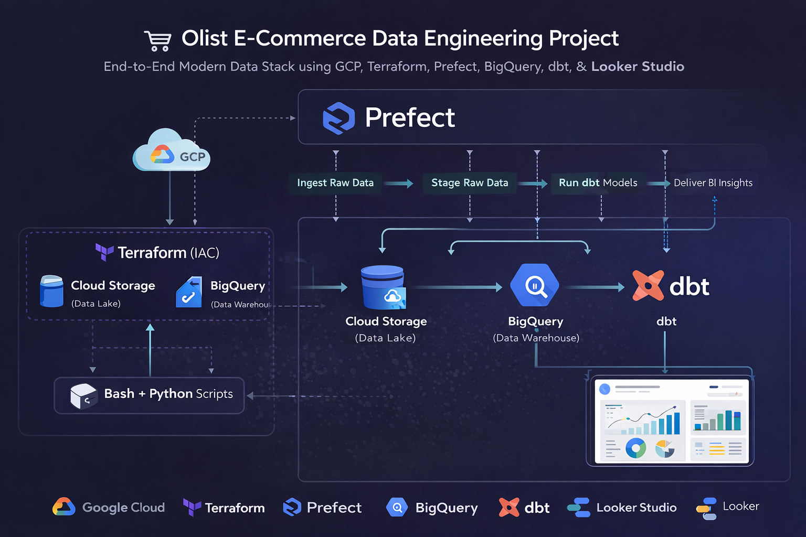
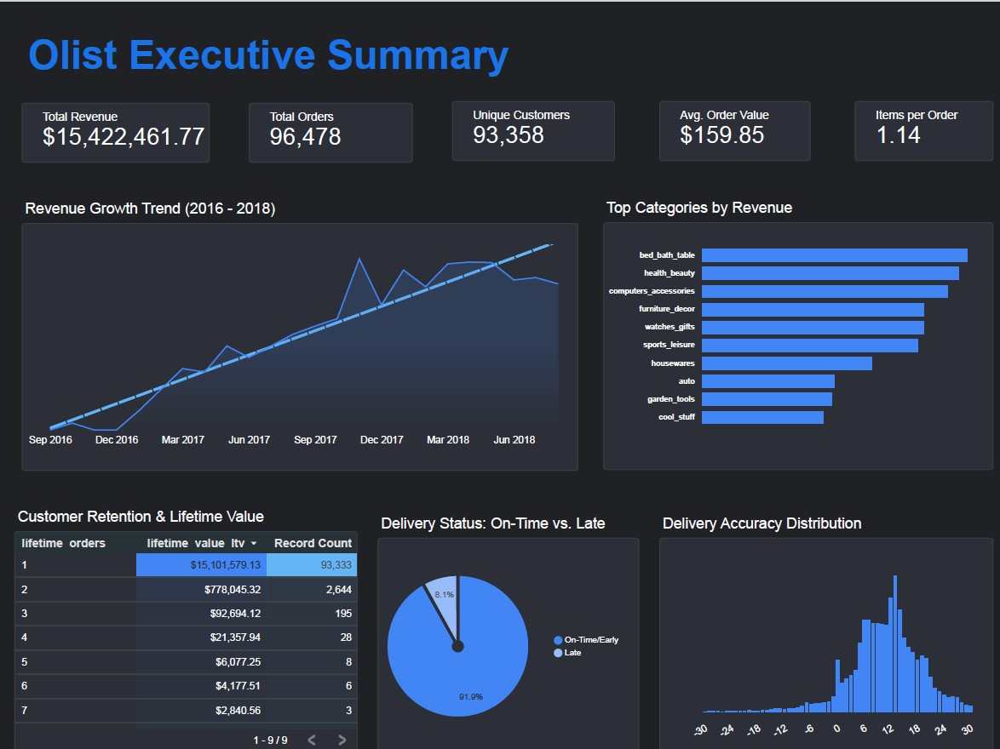
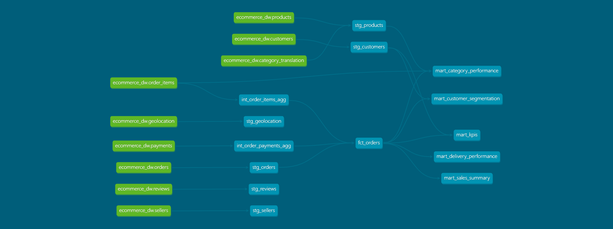

# 🛒 Olist E-Commerce Data Engineering Project

**End-to-End Modern Data Stack using GCP, Terraform, Prefect, BigQuery, dbt & Looker Studio**


## 📝 Featured Articles

[](https://medium.com/@ganiukuku/i-built-a-production-grade-data-pipeline-on-gcp-and-a-single-join-almost-blew-up-15-million-in-c0d4e3688e1e)

**"How a single LEFT JOIN silently inflated $15M in revenue — and how I fixed it."**

[](https://medium.com/@ganiukuku/i-built-a-data-pipeline-on-gcp-and-did-a-cost-audit-heres-what-i-found-65362ed883cf)

**"I audited my GCP data pipeline costs to uncover hidden inefficiencies and understand where the money was going."**

## 💼 What This Project Demonstrates
- End-to-end pipeline design on GCP
- Infrastructure as Code with Terraform
- Workflow orchestration with Prefect
- Data modeling with dbt (Medallion Architecture)
- Debugging real-world data integrity issues
- Cost and performance optimization in BigQuery

## 📊 About the Dataset

This project utilizes the **[Brazilian E-Commerce Public Dataset by Olist](https://www.kaggle.com/datasets/olistbr/brazilian-ecommerce)**, sourced from Kaggle. 

The data consists of nearly 100,000 anonymized orders placed between 2016 and 2018 across multiple marketplaces in Brazil. It includes multiple relational tables covering customers, orders, items, products, payments, and geographic locations. The high dimensionality and real-world messiness of this data (such as differing levels of granularity) made it the perfect candidate for building a robust Medallion architecture and practicing complex data modeling.

---

## 📌 Project Overview

The Olist dataset represents a real-world Brazilian e-commerce platform with nearly 100k orders across multiple interconnected tables.

This project builds a **production-style end-to-end data pipeline** that ingests raw CSV data, stores it in a cloud data lake, loads it into a data warehouse, and transforms it into an analytics-ready **Star Schema**. 

The pipeline is fully provisioned via **Infrastructure as Code (IaC)** and orchestrated using a **Directed Acyclic Graph (DAG)** to ensure reliability, fault tolerance, and scalability.

### 🎯 Objectives
Enable stakeholders to answer key business questions regarding:
- Revenue growth 📈  
- Customer lifetime value (LTV) 👤  
- Delivery performance 🚚  

---

## 🏗️ Architecture & Orchestration



### ⚙️ Workflow Orchestration (Prefect DAG)
The pipeline is fully automated using **Prefect** as the workflow orchestrator. 
* **Data Dependencies:** BigQuery ingestion strictly waits for successful GCS uploads, and dbt transformations only trigger upon successful data warehouse loading.
* **Fault Tolerance:** Tasks are configured with automated retries (`retries=2`) to gracefully handle transient cloud network API timeouts.
* **Observability:** Utilizes Prefect's native logger for capturing detailed execution states and dbt compilation logs.


---

## 📊 Dashboard & Business Insights



🔗 **Live Dashboard:** [View on Looker Studio](https://lookerstudio.google.com/reporting/a8f06a74-485c-45e9-9554-3c5b36d7746e)

### 1. The "One-and-Done" Retention Crisis 🚨
* **Insight:** Out of 93,358 customers, 93,333 made only one purchase.
* **Impact:** Customer Lifetime Value (LTV) is extremely low and revenue depends heavily on new customer acquisition.
* **Recommendation:** Introduce loyalty programs, second-purchase incentives, and email retargeting campaigns.

### 2. Logistics is a Major Strength 🚚
* **Insight:** 91.9% of orders are delivered on time or early.
* **Impact:** Strong delivery performance builds customer trust and competitive advantage.
* **Recommendation:** Leverage fast delivery in marketing and customer acquisition campaigns.

### 3. Home & Personal Care Dominate Sales 🛋️
* **Insight:** Top categories: `bed_bath_table`, `health_beauty`, `computers_accessories`.
* **Impact:** Revenue is concentrated in lifestyle-driven categories.
* **Recommendation:** Prioritize these categories in ads, inventory planning, and promotions.

### 4. Low-Ticket, Single-Item Buying Behavior 🛒
* **Insight:** AOV = $159.85, avg items/order = 1.14.
* **Impact:** Low basket size limits revenue per transaction.
* **Recommendation:** Introduce bundling, upselling, and free shipping thresholds.

---

## 🛠️ Tech Stack

- **Cloud Platform:** Google Cloud Platform (GCP)
- **Infrastructure as Code (IaC):** Terraform
- **Data Lake:** Google Cloud Storage (GCS)
- **Data Warehouse:** BigQuery
- **Transformation Layer:** dbt (data build tool)
- **Workflow Orchestration:** Prefect
- **Programming Language:** Python
- **BI Tool:** Looker Studio
- **Environment:** GitHub Codespaces

---

## 🔀 Transformation Pipeline (Medallion Architecture)

All transformations are managed using **dbt**, ensuring modular, testable, and production-ready data pipelines.



### 🥉 Bronze Layer (Staging)
**Focus: Data Sanitization & Refactoring**
Raw tables are converted into dependable, cleanly cast foundations.
- **Renaming:** Technical names (`zip_code_prefix`) to business terms (`zip_code`).
- **Casting:** Strings cast to proper `TIMESTAMP`, `DATE`, and numeric formats.
- **Localization:** Joined products with `category_translation` to replace Portuguese categories with English.

### 🥈 Silver Layer (Intermediate & Fact)
**Focus: Granularity Alignment & Integrity**
Solves the critical **Revenue Explosion** issue. Since a single order can have multiple items and payments, joining them directly duplicates revenue.
- **Solution:** Built `int_order_items_agg` and `int_order_payments_agg` to `GROUP BY order_id` before joining to the central fact table, guaranteeing 100% financial accuracy.

### 🥇 Gold Layer (Business Marts)
**Focus: Presentation & Business Value**
Specialized, highly-aggregated tables designed for Looker Studio performance:
- `mart_sales_summary`: Monthly revenue trends and order counts.
- `mart_kpis`: High-level scorecard headers (LTV, AOV, Total Revenue).
- `mart_customer_segmentation`: Ranks customers by spend and lifecycle.
- `mart_delivery_performance`: Measures the "Delivery Gap" (Expected vs. Actual Date).

---

## ⚡ Performance & Cost Optimization

### 1. Incremental Materialization
To optimize compute costs on historical data (like the 1M+ row geolocation table), models were converted to `materialized='incremental'`. dbt uses `is_incremental()` to only merge new records arriving after the `MAX(order_purchase_timestamp)`. 
* **Impact:** Reduced data processed per subsequent run by >90%.

### 2. BigQuery Partitioning & Clustering
The central `fct_orders` table was physically optimized in the data warehouse.
* **Partitioning:** Grouped by `order_purchase_timestamp` at the month granularity to restrict data scans during time-series queries.
* **Clustering:** Sorted by `customer_id` to speed up specific customer lookups and aggregate LTV calculations.

---

## 🛡️ Data Quality & Testing
Automated dbt tests enforce strict data contracts before visualization:
- **Schema Tests:** `unique` and `not_null` constraints deployed on all primary keys.
- **Referential Integrity:** Applied relationship (foreign key) tests to ensure 0% "orphan" records between fact and dimension tables.

---

## 🙏 Acknowledgements
This project was submitted as capstone project to 
[DataTalks.Club Data Engineering Zoomcamp](https://github.com/DataTalksClub/data-engineering-zoomcamp) 
— a free, project-based bootcamp for aspiring data engineers.

---

## 📋 Prerequisites
- Google Cloud Platform account with billing enabled
- Kaggle account + API key (to download the dataset)
- Python 3.11+
- Terraform installed
- Prefect installed

---

## 🚀 How to Run this Project

**1. Clone the repository**

```bash
git clone https://github.com/GaniuKuku/ecommerce-data-engineering-project.git
cd ecommerce-data-engineering-project
```

**2. Provision Cloud Infrastructure**

Ensure you have GCP credentials configured in your environment, then run:
```bash
cd terraform
terraform init
terraform apply
```

**3. Run the Data Pipeline**

Install dependencies and execute the Prefect orchestrator to move data from local CSVs → GCS → BigQuery → dbt:
```bash
pip install -r requirements.txt
python orchestrate.py
```

**4. View the Pipeline DAG**

Spin up the Prefect UI to view the task execution graph:
```bash
prefect server start
```


