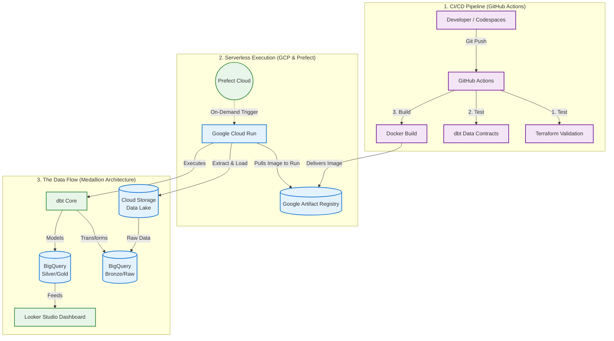

# 🛒 Olist E-Commerce Data Engineering Project (v2.0 - Production Architecture)

**📌 Version Notice:** This is the `main` branch representing Version 2, focusing on serverless cloud deployment, automated CI/CD pipelines, hardened code standards, and infrastructure security.  
*To view the original local Proof-of-Concept, check out the `[Version 1 Archive](https://github.com/GaniuKuku/ecommerce-data-engineering-project/tree/archive-v1)` branch.*

**Serverless Modern Data Stack using GCP, Cloud Run, Terraform, Prefect Cloud, BigQuery, dbt, GitHub Actions & Looker Studio**




## 🚀 The V2 Upgrade: From Local Script to Serverless Cloud
Version 1 successfully moved data, but Version 2 was engineered for production. Following a rigorous code review, the entire codebase was refactored to meet enterprise software engineering and DevOps standards to handle a 4x scale-up in data volume (processing 2019 data).

### 🏗️ Infrastructure as Code (Terraform) Hardening
* **Security First:** Implemented strict IAM policies and enforced public access prevention on all storage buckets.
* **State Management:** Migrated from local state to remote backend state management for team-ready deployment.
* **Reusability & Safety:** Replaced hardcoded variables with dynamic `tfvars` and removed dangerous `force_destroy = true` flags to prevent accidental production data loss.
* **Cost Tracking:** Implemented comprehensive resource tagging across all GCP assets.

### ⚙️ Serverless DevOps & Automated CI/CD
* **Continuous Delivery Pipeline (New):** Implemented a fully automated CI/CD pipeline using **GitHub Actions**. Every pull request and push to the `main` branch undergoes a strict two-stage validation:
  1. **Infrastructure Check:** Terraform plans are verified against GCP to ensure resource integrity.
  2. **Data Contract Testing:** A `dbt build` is executed to ensure new code doesn't break existing financial models or data quality tests.
* **Containerization:** Only upon passing all tests is the Python execution code and dbt core packaged into a Docker container and delivered securely to Google Artifact Registry.
* **Zero-Ops Compute:** Deployed to Google Cloud Run, moving from a static machine to a highly scalable, serverless environment that bills only per millisecond of execution.
* **Cloud Orchestration:** Shifted from a local SQLite Prefect database to Prefect Cloud for remote observability, scheduling, and UI-based pipeline tracking.

### 🧹 Code Quality & Data Governance
* **Python Resiliency:** Replaced basic print statements with a production logger, added comprehensive function docstrings, and implemented strict `try/except` error handling.
* **dbt Best Practices:** Eliminated lazy `SELECT *` queries. Introduced config blocks inside models for precise materialization control, expanded the `sources.yml` definitions, and wrote custom data tests to catch edge-case anomalies.

### 🎯 Objectives
Enable stakeholders to answer key business questions regarding:
- Revenue growth 📈  
- Customer lifetime value (LTV) 👤  
- Delivery performance 🚚  

---

## 🏗️ Architecture & Orchestration


### ⚙️ Workflow Orchestration (Prefect DAG)
The pipeline is fully automated using **Prefect** as the workflow orchestrator. 
* **Data Dependencies:** BigQuery ingestion strictly waits for successful GCS uploads, and dbt transformations only trigger upon successful data warehouse loading.
* **Fault Tolerance:** Tasks are configured with automated retries (`retries=2`) to gracefully handle transient cloud network API timeouts.
* **Observability:** Utilizes Prefect's native logger for capturing detailed execution states and dbt compilation logs.


---

## 📊 Dashboard & Business Insights (Scaled Dataset)


🔗 **Live Dashboard:** [View on Looker Studio](https://lookerstudio.google.com/reporting/a8f06a74-485c-45e9-9554-3c5b36d7746e)

**1. Explosive Growth, But the Retention Crisis Remains 🚨**
* **Insight:** Out of 386,051 total orders, an overwhelming 367,558 belong to customers who made only a single purchase.
* **Impact:** The business can acquire customers at an incredible scale, but Lifetime Value (LTV) is bleeding out.
* **Recommendation:** Implement automated 30-day post-purchase retargeting campaigns to convert the massive pool of one-time buyers.

**2. Logistics is a True Superpower 🚚**
* **Insight:** As volume scaled 4x, on-time and early deliveries actually improved from 91.9% to a staggering 98%.
* **Impact:** The operational foundation is incredibly resilient.
* **Recommendation:** Make this 98% on-time delivery rate a core pillar of customer acquisition marketing.

**3. A Shift in Lifestyle Categories 🛋️**
* **Insight:** `sports_leisure` surged past tech products to become the #3 highest-grossing category, sitting right behind `bed_bath_table` and `health_beauty`.
* **Impact:** The customer base is leaning heavily into personal wellness and home goods.
* **Recommendation:** Shift ad spend and inventory forecasting to capitalize on the momentum of the sports and leisure category.

**4. Basket Size is Shrinking 🛒**
* **Insight:** Despite the revenue surge, Average Order Value (AOV) dipped to $155.63, and the average items per order dropped to an almost flat 1.04.
* **Impact:** Customers are buying strictly what they came for with virtually no cross-selling happening at checkout.
---

## 🛠️ Tech Stack

- **Cloud Platform:** Google Cloud Platform (GCP)
- **Infrastructure as Code (IaC):** Terraform
- **Data Lake:** Google Cloud Storage (GCS)
- **Data Warehouse:** BigQuery
- **Transformation Layer:** dbt (data build tool)
- **Workflow Orchestration:** Prefect
- **Programming Language:** Python
- **BI Tool:** Looker Studio
- **Environment:** GitHub Codespaces

---

## 🔀 Transformation Pipeline (Medallion Architecture)

All transformations are managed using **dbt**, ensuring modular, testable, and production-ready data pipelines.


### 🥉 Bronze Layer (Staging)
**Focus: Data Sanitization & Refactoring**
Raw tables are converted into dependable, cleanly cast foundations.
- **Renaming:** Technical names (`zip_code_prefix`) to business terms (`zip_code`).
- **Casting:** Strings cast to proper `TIMESTAMP`, `DATE`, and numeric formats.
- **Localization:** Joined products with `category_translation` to replace Portuguese categories with English.

### 🥈 Silver Layer (Intermediate & Fact)
**Focus: Granularity Alignment & Integrity**
Solves the critical **Revenue Explosion** issue. Since a single order can have multiple items and payments, joining them directly duplicates revenue.
- **Solution:** Built `int_order_items_agg` and `int_order_payments_agg` to `GROUP BY order_id` before joining to the central fact table, guaranteeing 100% financial accuracy.

### 🥇 Gold Layer (Business Marts)
**Focus: Presentation & Business Value**
Specialized, highly-aggregated tables designed for Looker Studio performance:
- `mart_sales_summary`: Monthly revenue trends and order counts.
- `mart_kpis`: High-level scorecard headers (LTV, AOV, Total Revenue).
- `mart_customer_segmentation`: Ranks customers by spend and lifecycle.
- `mart_delivery_performance`: Measures the "Delivery Gap" (Expected vs. Actual Date).

---

## ⚡ Performance & Cost Optimization

### 1. Incremental Materialization
To optimize compute costs on historical data (like the 1M+ row geolocation table), models were converted to `materialized='incremental'`. dbt uses `is_incremental()` to only merge new records arriving after the `MAX(order_purchase_timestamp)`. 
* **Impact:** Reduced data processed per subsequent run by >90%.

### 2. BigQuery Partitioning & Clustering
The central `fct_orders` table was physically optimized in the data warehouse.
* **Partitioning:** Grouped by `order_purchase_timestamp` at the month granularity to restrict data scans during time-series queries.
* **Clustering:** Sorted by `customer_id` to speed up specific customer lookups and aggregate LTV calculations.

---

## 🛡️ Data Quality & Testing
Automated dbt tests enforce strict data contracts before visualization:
- **Schema Tests:** `unique` and `not_null` constraints deployed on all primary keys.
- **Referential Integrity:** Applied relationship (foreign key) tests to ensure 0% "orphan" records between fact and dimension tables...

---

## 🙏 Acknowledgements
This project was submitted as capstone project to 
[DataTalks.Club Data Engineering Zoomcamp](https://github.com/DataTalksClub/data-engineering-zoomcamp) 
— a free, project-based bootcamp for aspiring data engineers.

---

## 📋 Prerequisites
- Google Cloud Platform account with billing enabled
- Kaggle account + API key (to download the dataset)
- Python 3.11+
- Terraform installed
- Prefect installed

---

## 🚀 How to Run this Project

**1. Clone the repository**

```bash
git clone https://github.com/GaniuKuku/ecommerce-data-engineering-project.git
cd ecommerce-data-engineering-project
```

**2. Provision Cloud Infrastructure**

Ensure you have GCP credentials configured in your environment, then run:
```bash
cd terraform
terraform init
terraform apply
```

**3. Run the Data Pipeline**

Install dependencies and execute the Prefect orchestrator to move data from local CSVs → GCS → BigQuery → dbt:
```bash
pip install -r requirements.txt
python orchestrate.py
```

**4. View the Pipeline DAG**

Spin up the Prefect UI to view the task execution graph:
```bash
prefect server start
```


