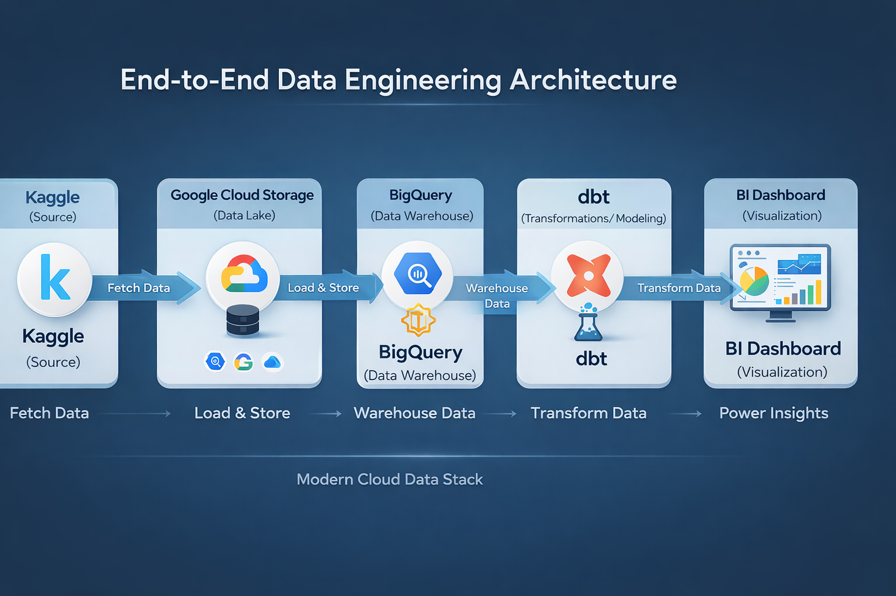

# 🛒 Olist E-Commerce Data Engineering Project

End-to-End Modern Data Stack using GCP, BigQuery, dbt & Looker Studio

## 🏗️ Architecture Diagram

## 📌 Project Overview

The Olist dataset represents a real-world Brazilian e-commerce platform with over 100k orders across multiple interconnected tables.

This project builds a scalable **Modern Data Stack** that transforms raw, messy CSV data into a clean, analytics-ready **Star Schema** in BigQuery.

The goal is to enable business stakeholders to answer key questions around:
- Revenue growth 📈
- Customer lifetime value (LTV) 👤
- Delivery performance 🚚

All transformations are managed using **dbt**, ensuring modular, testable, and production-ready data pipelines.

🛠️ The Tech Stack
Infrastructure: Google Cloud Platform (GCP)

Data Lake (Storage): Google Cloud Storage (GCS)

Data Warehouse: BigQuery

Transformation Layer: dbt (data build tool)

Version Control & CI/CD: GitHub Codespaces

Business Intelligence: Looker Studio

## 🚀 Key Achievements

- Built a full end-to-end data pipeline (Kaggle → GCS → BigQuery → dbt → BI)
- Designed a **Star Schema** for analytics
- Solved **data duplication (revenue explosion)** using aggregation
- Implemented **incremental models**, reducing compute cost by >90%
- Enforced **data quality with dbt tests**
- Created business-ready marts for dashboards

## 🔄 2. dbt Lineage (Medallion Architecture)

## 🏗️ 3. Physical dbt Pipeline: The Medallion Approach

The core transformation logic in dbt follows a rigid, three-layer approach. The standard ref() function is used to build a non-brittle, maintainable pipeline that always runs in the correct order.

This diagram is the visual blueprint of the project. It shows how the data is handled at each layer of the transformation lifecycle.

### 3.1. Bronze Layer (Staging)

Focus: Data Sanitization & Refactoring

Raw tables are converted into dependable, cleanly cast foundations.

- Renaming: Technical column names (e.g., zip_code_prefix) are renamed to clean business terms (zip_code).
- Casting: Strings are correctly cast to proper TIMESTAMP, DATE, and numeric formats.
- Null Handling: Used COALESCE to replace null values with placeholders (e.g., 'No Comment').
- Localization: Performed a LEFT JOIN between products and category_translation to replace all Portuguese category names with English versions.

---

### 3.2. Silver Layer (Intermediate & Fact)

Focus: Granularity Alignment & Integrity

This layer solves the most critical data quality issue in the Olist dataset: Revenue Explosion. Since a single order can have multiple items and multiple payment methods, joining them directly duplicates revenue.

Solution: Built int_order_items_agg and int_order_payments_agg. These intermediate models perform a GROUP BY order_id before joining to the central fact. This guarantees 100% financial accuracy.

The Fact Table: fct_orders is constructed by joining the sanitized stg_orders with the two pre-aggregated intermediate models.

---

### 3.3. Gold Layer (Business Marts)

Focus: Presentation & Business Value

The Gold layer contains specialized, highly-aggregated tables designed for high-performance dashboarding in Looker Studio or Power BI.

- mart_sales_summary: Tracks monthly revenue trends and order counts.
- mart_kpis: Provides high-level "scorecard" headers (LTV, AOV, Total Revenue).
- mart_customer_segmentation: Ranks customers by spend and lifecycle.
- mart_delivery_performance: Operations table measuring the "Delivery Gap" (Expected Date vs. Actual Date).

---

## 🛡️ 4. Cost-Optimization (Incremental Models)

The Olist dataset contains the large geolocation table (over 1M rows) and a growing orders fact table.

To optimize BigQuery compute and network costs, I implemented Incremental Materialization:

- The Problem: Running a full drop-and-rebuild on 1M rows or re-calculating the entire history of Olist (from 2016-2018) is costly and slow.

- The Solution: Converted stg_geolocation and fct_orders to materialized='incremental'. On the first run, the full table is built. On subsequent runs, dbt uses a special is_incremental() check to only insert or merge new or updated records that have arrived since the previous MAX(order_purchase_timestamp).

- The Impact: Reduced data processed per subsequent run by over 90%, ensuring a sustainable and scalable cloud warehouse infrastructure.

This visual illustrates how dbt filters for new timestamps during incremental runs:

---

## 🛡️ 5. Data Quality & Referential Integrity

To transform this into a professional data platform, I implemented automated dbt tests to enforce strict data contracts.

- Schema Tests: Deployed automated unique and not_null constraints to guarantee the integrity of all primary keys (order_id, customer_id).

- Relationship Tests: Applied relationship (foreign key) tests. If dbt attempts to add an order to the Fact table that does not have a corresponding customer ID in the DIM_CUSTOMERS table, the test will FAIL. This guarantees 0% "orphan" records.

- Pass Rate: Verified that all tests pass successfully before the final visualization step.n all unique, not_null, and relationships constraints.

Generated Documentation: Run dbt docs generate && dbt docs serve to view the comprehensive data catalog and lineage graph.
